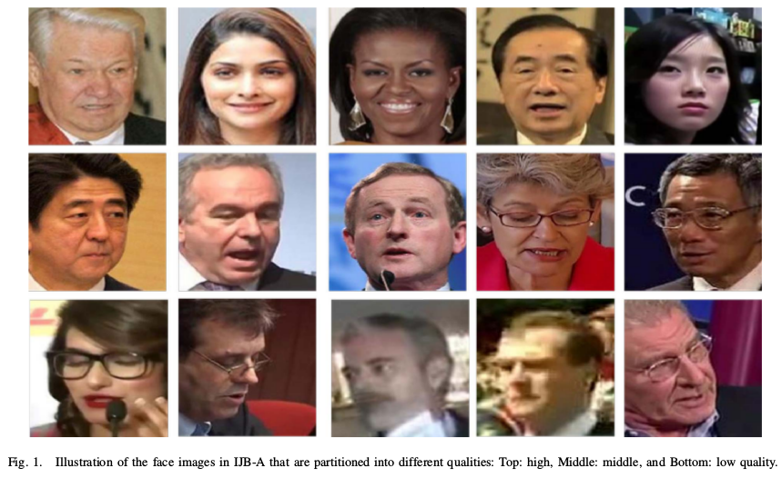
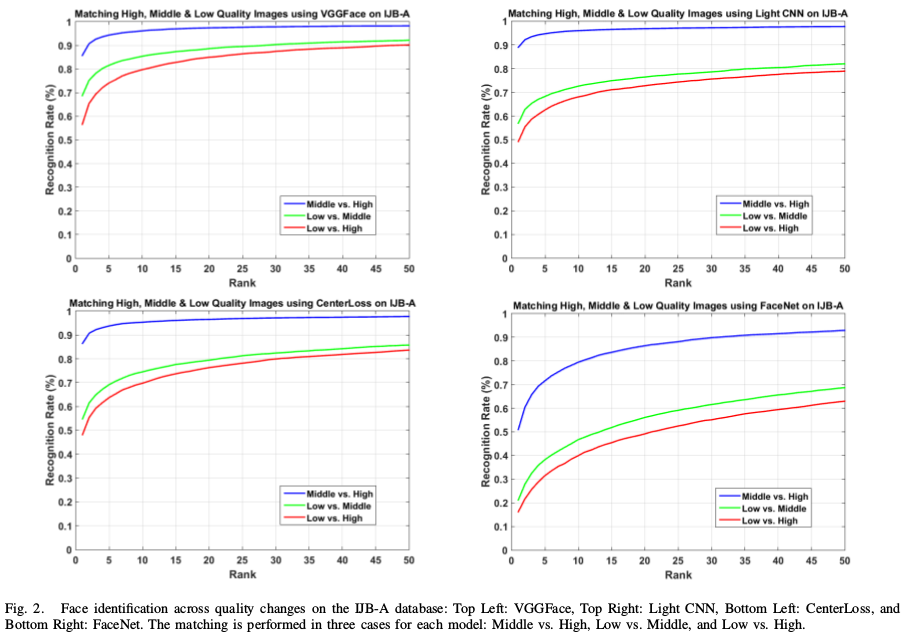
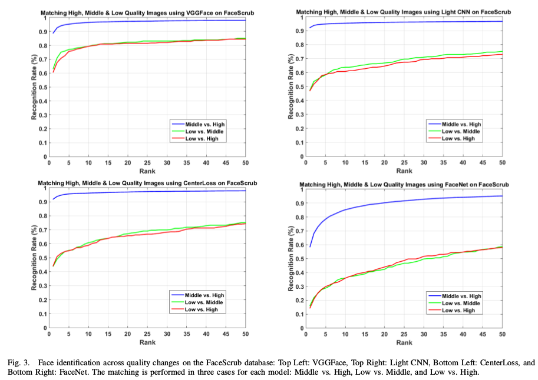
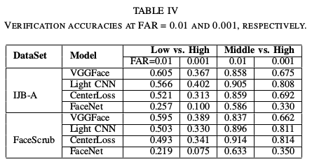
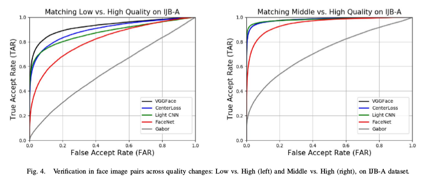
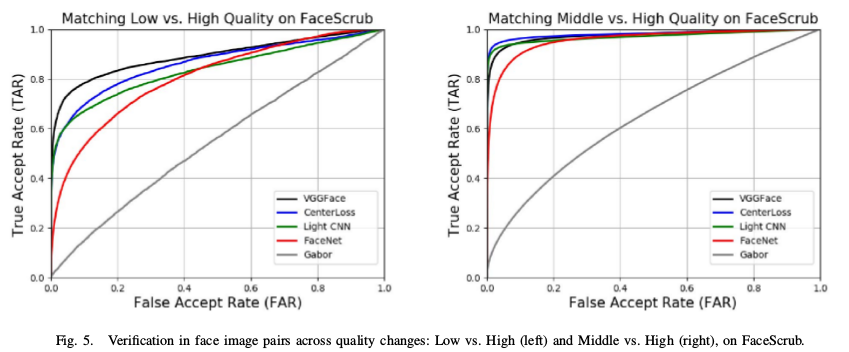

This repository is for main codes of paper :[FG2018] What is the Challenge for Deep Learning in Unconstrained Face Recognition?.

# introduction
Abstract— Recently deep learning has become dominant in face recognition and many other artificial intelligence areas. We raise a question: Can deep learning truly solve the face recognition problem? If not, what is the challenge for deep learning methods in face recognition? We think that the
face image quality issue might be one of the challenges for deep learning, especially in unconstrained face recognition. To investigate the problem, we partition face images into different qualities, and evaluate the recognition performance, using the state-of-the-art deep networks. Some interesting results are obtained, and our studies can show directions to promote the deep learning methods towards high-accuracy and practical use in solving the hard problem of unconstrained face recognition.

### Link: 

[[PDF]](https://ieeexplore.ieee.org/abstract/document/8373863)

# code description
1. code_face_verification: python code to implement face verification
2. code_face_identification: matlab code for Face identification
3. human_recognition_tool.py: a tool used to verify two face images shown if they belong to one identity
4. code_analysis_ROC: draw ROC
5. code_compute_AUC: compute AUC

# experiments
* We explicitly partition face images into different qualities (low, middle, high), and then evaluate the performance of face recognition across quality variations. We believe that this is the way to find the real challenges in unconstrained FR. 
* The quality partition of face images is performed on two public databases, the IJB-A and FaceScrub. 
* We design recognition protocols with both identification and verification. In either case, the matching of faces is always across quality changes.
* We choose four representative deep models, VGGFace, Light CNN, CenterLoss, and FaceNet,for our evaluation and comparisons.

# face identification result

# face verification result

