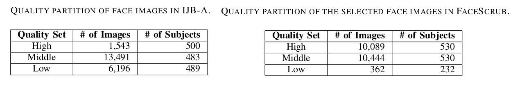
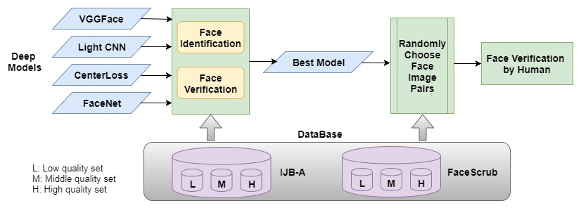
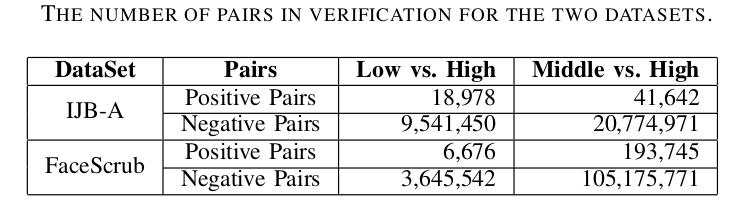
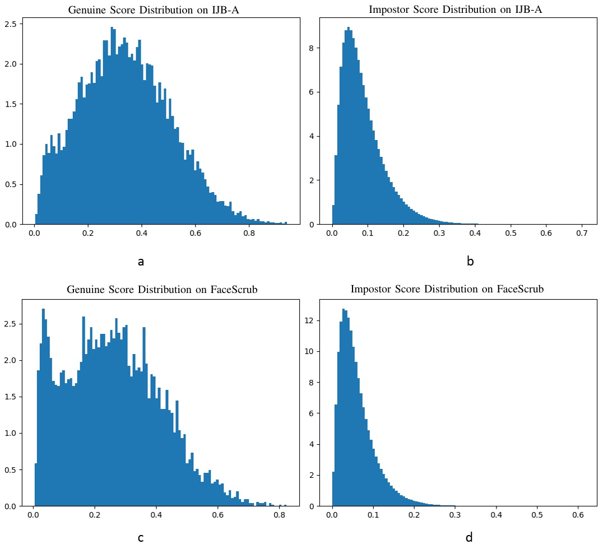
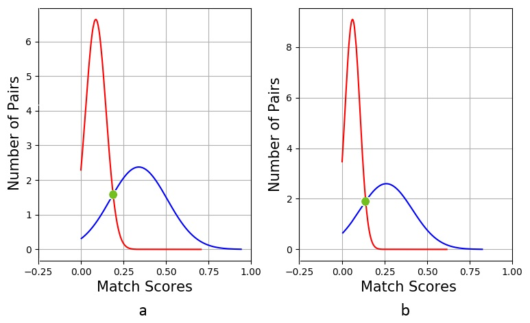
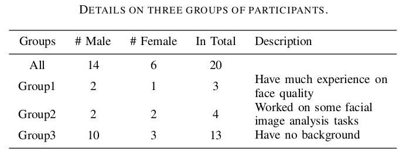
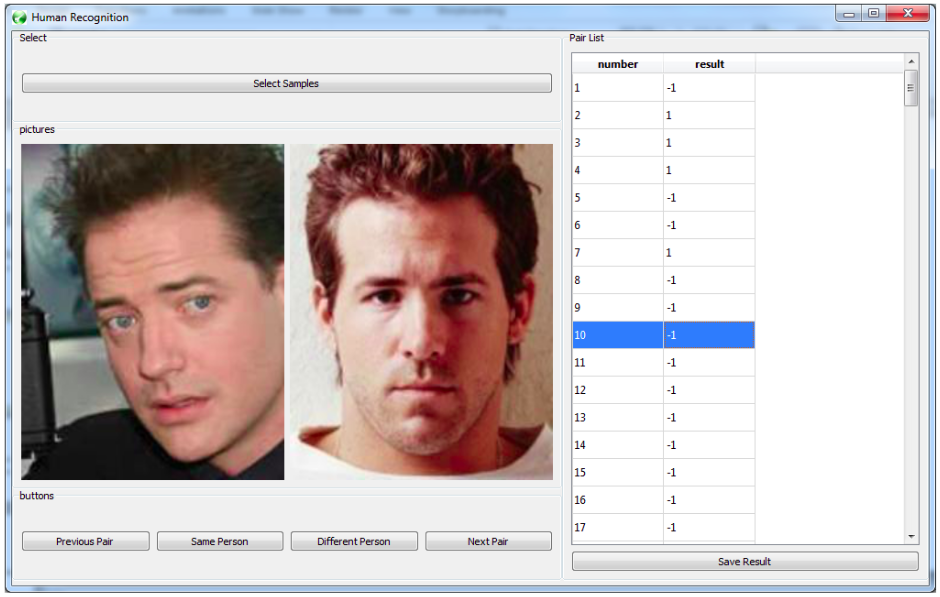
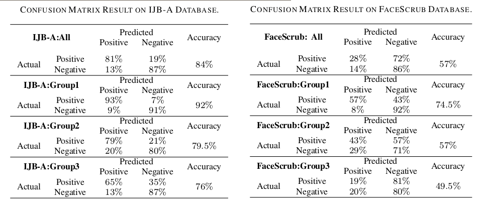
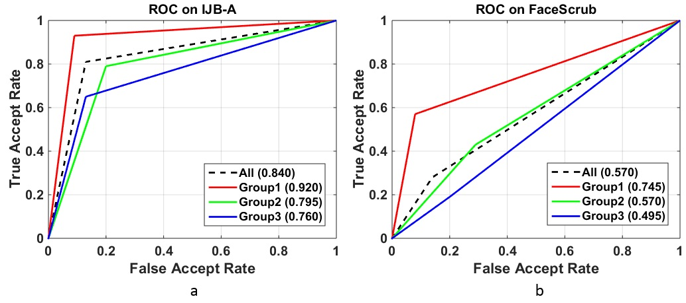

This repository contains the main codes of face identification and face verification used in paper: What is the Challenge for Deep Learning in Unconstrained Face Recognition?

### Link: 
[[Paper]](https://ieeexplore.ieee.org/abstract/document/8373863)

[[Report]](https://arxiv.org/abs/2307.02679)

# Abstract
Recently deep learning has become dominant in face recognition and many other artificial intelligence areas. We raise a question: Can deep learning truly solve the face recognition problem? If not, what is the challenge for deep learning methods in face recognition? We think that the
face image quality issue might be one of the challenges for deep learning, especially in unconstrained face recognition. To investigate the problem, we partition face images into different qualities, and evaluate the recognition performance, using the state-of-the-art deep networks. Some interesting results are obtained, and our studies can show directions to promote the deep learning methods towards high-accuracy and practical use in solving the hard problem of unconstrained face recognition.

# Motivation
* To examine the performance of cross quality face recognition
* Compare with human face recognition performance on cross-quality faces
* Focus on extremely difficult level of face images (those face images that deep model fails to recognize successfully)

# Databases
* Two datasets
  
    IJB-A:   21,230 images (500 subjects)
    
    FaceScrub:   78,650 images (530 subjects)

* Divide each dataset into three groups using same protocol (according to face quality score).
  
    High quality set:  image quality score >= 60
    
    Middle quality set:  image quality score in [30, 60)
    
    Low quality set:  image quality score < 30

# Pipeline
 

 # Partition Database
* Explicitly partition face images into different qualities (low, middle, high), and then evaluate the performance of face recognition across quality variations. We believe that this is the way to find the real challenges in unconstrained FR. 
* The quality partition of face images is performed on two public databases, the IJB-A and FaceScrub.
  
* Design recognition protocols with both identification and verification. In either case, the matching of faces is always across quality changes.
* Choose four representative deep models, VGGFace, Light CNN, CenterLoss, and FaceNet,for our evaluation and comparisons.

# Face identification result

# Face verification result
Calculate the Verification Accuracy with respect to :
FAR=0.01,
FAR=0.001,
FAR=0.0001.

# Face Verification by participants
 
* Choose the deep model with best performance among the four models in face verification experiments.
* Find the best decision boundary for positive and negative pairs based on the selected deep model.

   
   Fig. shows Genuine and impostor score distribution on IJB-A and FaceScrub. (a) genuine score distribution on IJB-A, (b) impostor score distribution on IJB-A, (c) genuine score distribution on FaceScrub, and (d) impostor score distribution on FaceScrub.

   
   Genuine (blue line) and impostor (red line) matching score distribution on (a) IJB-A and (b) FaceScrub. The threshold value is from the match score
of green dot shows. 
  
* Randomly select those pairs that the selected deep model fails to recognize correctly.
* Recruit humans to perform face verification on these selected pairs using a recognition tool.
   
   

# Human Face Verification Result
   
   

# Content description
1. code_face_verification: python code to implement face verification
2. code_face_identification: matlab code for Face identification
3. human_recognition_tool.py: a tool used to verify two face images shown if they belong to one identity
4. code_analysis_ROC: draw ROC
5. code_compute_AUC: compute AUC  

